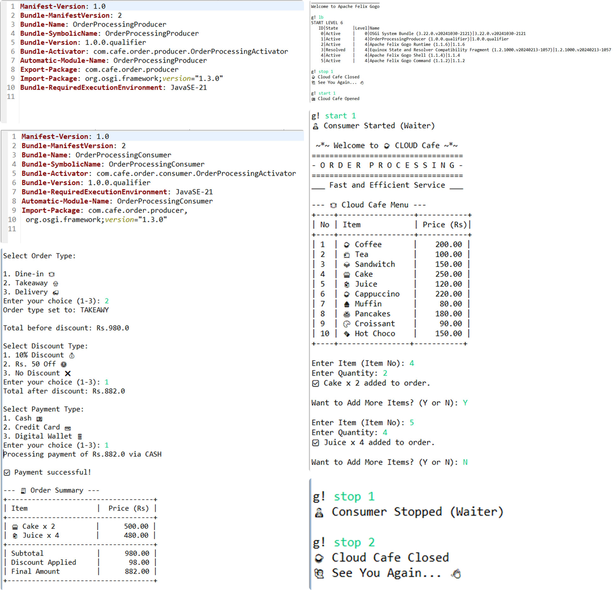

# ☕ Cloud Café - Smart Café Management System




## Introduction

The **Smart Café Management System** is designed to streamline the daily operations of a modern café using the **OSGI framework**. The system leverages a **microkernel architecture** to provide **modular, scalable, and efficient** management of key café operations. By dividing the system into **Producer** and **Consumer** bundles, the café can handle tasks such as **order processing, stock management, payment processing, and employee shift management** decoupled and flexible.

---

#### Objectives

- **Efficient Order Management:** Handle customer orders seamlessly and ensure timely service.

### 📌 Order Processing Service -> Waiter

The **Order Processing Service** manages new orders and sends the details to the **Waiter**.

## Order Management System Explanation

The **Order Processing System** begins by welcoming the user and displaying a menu. Users select items, specify quantities, and confirm additions. They can choose to add more items or proceed to select an order type. The system calculates the total bill, applies a discount if specified, and displays the final amount. Users then select a payment method, and the system processes the payment. Finally, an order summary is displayed, and the system concludes with a **goodbye message**.

### 1️⃣ Welcome Message

- The system greets the user with a friendly message, indicating that it is ready to take an order.

### 2️⃣ Display Menu

- Displays the menu, including a list of items with their **item numbers, names, and prices**.

### 3️⃣ Ordering Items

- Prompts the user to **enter the item number and quantity**.
- Confirms each addition with a ✅ emoji, displaying the item name and quantity.

### 4️⃣ Adding More Items

- The system asks if the user wants to add more items:
  - **Y (Yes):** Continue adding items.
  - **N (No):** Proceed to the next step.

### 5️⃣ Select Order Type

- The user selects the order type:
  - **Dine-in 🍽️**: Eating at the café.
  - **Takeaway 🥡**: Taking food to go.
  - **Delivery 🚚**: Food delivered to their location.

### 6️⃣ Calculate Total Before Discount

- The system calculates the total **before applying any discounts** and displays the amount.

### 7️⃣ Apply Discount

- The system offers the user **discount options**:
  - **10% Discount 💰**: Deducts 10% from the total bill.
  - **Rs. 50 Off 🪙**: Flat discount of Rs. 50.
  - **No Discount ❌**: No discount is applied.

### 8️⃣ Calculate Total After Discount

- Displays the **final bill amount** after applying the selected discount.

### 9️⃣ Select Payment Type

- The user selects a payment method:
  - **Cash 💵**: Pay with cash.
  - **Credit Card 💳**: Pay using a credit card.
  - **Digital Wallet 📱**: Pay using a digital wallet (e.g., PayPal, Google Pay).

### 🔟 Process Payment

- Processes the payment based on the selected method:
  - **✅ Success Message**: Payment successful.
  - **❌ Failure Message**: Payment failed.

### 1️⃣1️⃣ Display Order Summary 🧾

- Displays a **detailed summary** including:
  - Ordered items with quantity & price.
  - Subtotal (before discount).
  - Applied discount (if any).
  - Final total (after discount).

### 1️⃣2️⃣ Goodbye Message

- The system displays a **goodbye message** when the order process concludes.

---

## 📌 Technology Stack

- **Java** (Primary Language)
- **OSGI Framework** (Microkernel Architecture)

## 📌 Features

✔️ Modular & scalable architecture with **Producer** and **Consumer** bundles.  
✔️ Efficient **order processing** and **payment handling**.  
✔️ Multiple **payment methods** supported.  
✔️ Discounts & promotional offers integration.  
✔️ Flexible ordering options (**Dine-in, Takeaway, Delivery**).  

---

## 📌 OSGI Framework Commands

###### Start the OSGI Framework
```sh
java -jar felix.jar
```

###### Install the Producer Bundle
```sh
install file:OrderProcessingProducer.jar
```

###### Start the Producer Bundle
```sh
start file:OrderProcessingProducer.jar
```
or
```sh
start <bundle_id>
```

###### Stop the Producer Bundle
```sh
stop file:OrderProcessingProducer.jar
```
or
```sh
stop <bundle_id>
```

--- 

###### Install the Consumer Bundle
```sh
install file:OrderProcessingConsumer.jar
```

###### Start the Consumer Bundle
```sh
start file:OrderProcessingConsumer.jar
```
or
```sh
start <bundle_id>
```
###### Stop the Consumer Bundle
```sh
stop file:OrderProcessingConsumer.jar
```
or
```sh
stop <bundle_id>
```
